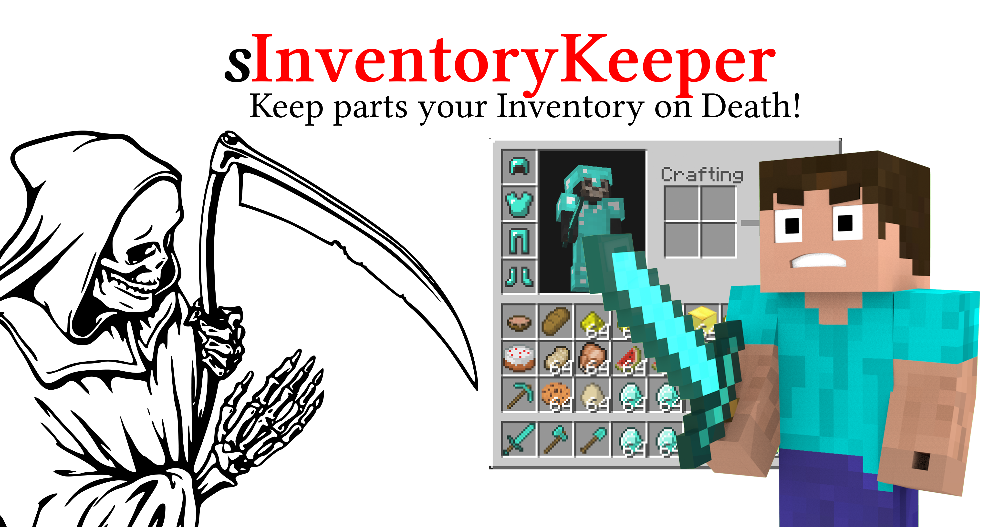

# sInventoryKeeper

[](../../actions?query=workflow%3ABuild)
[](https://codecov.io/gh/Silthus/sInventoryKeeper)
[](../../releases)
[](https://www.spigotmc.org/resources/sinventorykeeper.79988/)
[](https://www.spigotmc.org/resources/sinventorykeeper.79988/)
[](https://www.spigotmc.org/resources/sinventorykeeper.79988/)
[](http://commitizen.github.io/cz-cli/)
[](https://github.com/semantic-release/semantic-release)



A Spigot plugin that enables you to let your players keep a selection of their inventory on death. You can create multiple configs and assign different permissions for each config.

> This can be useful for servers that want their different donors to keep different parts of their inventory.

- [Features](#features)
- [Installation](#installation)
  - [Dependencies](#dependencies)
- [Configuration](#configuration)
  - [Item Groups](#item-groups)
  - [Inventory Keeper Configs](#inventory-keeper-configs)
- [Commands](#commands)
- [Developer API](#developer-api)

## Features

- Group items as `item-groups`  and use them inside the `inventory-keeper-configs`.
  - comes with two default groups: `weapons` and `armor`
- Create multiple `inventory-keeper-configs` for different ranks, groups, etc.
  - each config gets its own unique permission and is only applied to players that have that permission
  - configs can be mixed and matched
- Two config modes: `WHITELIST` and `BLACKLIST` for maximum control
  - `WHITELIST`: drop all items except the ones defined in the config
  - `BLACKLIST`: keep all items except the ones defined in the config
- Players can have multiple configs assigned to them
- API for developers to create custom inventory filters that will be applied on death
- over 85% unit test coverage

## Installation

Get the [latest release](../../releases/latest) and drop it into your `plugins/` directory.
Restart the server and take a look at the generated default configs inside the `sInventoryKeeper` plugin folder.

### Dependencies

This plugin **requires [sLib](https://github.com/Silthus/sLib)** which provides a lot of useful features and common functions for all of my plugins.

> [Download sLib](https://github.com/Silthus/sLib/releases/latest) and drop it into your plugin directory.

## Configuration

There are two types of configs `item-groups` and `inventory-keeper-configs`. You technically don't need to define item groups and can just use the keeper configs.
But to make your life easier it is adviced to **create common item groups** and reuse them inside the keeper configs.

### Item Groups

Item Groups are defined inside the `item-groups/` directory. You can find two examples (`weapons.yaml` and `armor.yaml`) and create more yourself.
The item group config only contains a `items` section and a **`name` which must be unique**.

> If you leave the `name` empty, the plugin will choose a unique name based on the location of the config.
> You can always change this later, but must adapt your `inventory-keeper-configs` as well.

```yaml
# delete this line to default to a unique name based on the location of the config
name: armor
# define your items that belong to this group here
# you don't need to prefix them with minecraft:
items:
- minecraft:leather_helmet
- minecraft:leather_chestplate
- minecraft:leather_leggings
- minecraft:leather_boots
- minecraft:chainmail_helmet
- minecraft:chainmail_chestplate
- minecraft:chainmail_leggings
- minecraft:chainmail_boots
- minecraft:iron_helmet
- minecraft:iron_chestplate
- minecraft:iron_leggings
- minecraft:iron_boots
- diamond_helmet
- diamond_chestplate
- diamond_leggings
- diamond_boots
- golden_helmet
- golden_chestplate
- golden_leggings
- golden_boots
```

### Inventory Keeper Configs

The meat of the plugin are the `inventory-keeper-configs` located inside the `configs/` folder.
Each config will have its own unique permission that can be assigned to players.
The permission always consists of a prefix (`sinventorykeeper.config.`) and the unique name of the file based of its path.

If you have a config named `example.yaml` inside the `configs/` directory, its permission will be: `sinventorykeeper.config.example`.

> Tip: the permissions for each config will be written in the log on startup.

A config looks like this.

```yaml
# You can define two different modes that will control how this config gets loaded.
# Allowed values (case sensitive): WHITELIST or BLACKLIST
# WHITELIST: only the defined items are kept
# BLACKLIST: all items excluding the defined items are kept
mode: WHITELIST
# Set this to false if you want to disable the config.
enabled: true
# Define a list of item groups that should be kept or dropped (depending on the mode).
# You can create custom item groups inside the item-groups/ folder.
item_groups:
- armor
# Define a list of items that should be kept or dropped (depending on the mode).
items:
- stone
- dirt
```

#### Changes in v3.0.0

You can now define how multiple filters of the same type should be handled in the `config.yaml` --> `combination_mode`.  
This means you can define if overlapping items from the same `WHITELIST` or `BLACKLIST` config are dropped or kept.

| Mode | Description |
| ---- | ----------- |
| `KEEP_ITEMS` (*default*) | In this mode any items that are kept by and of your config will be kept and all other items are dropped. |
| `DROP_ITEMS` | In this mode any items that should be dropped take precedence and are removed from the kept items of other configs. |

---
**IMPORTANT**  
> `WHITELIST` and `BLACKLIST` filters cannot be combined. Players can only have multiple filters of the same type.
---


## Commands

Currently there is only one command: reload the plugin including all configs.

| Command | Description | Permission |
| :-----: | ----------- | ------- |
| `/inventorykeeper reload` | Reloads all configs from disk and clears the cache. | `sinventorykeeper.admin.reload` |

## Developer API

You can provide your own `InventoryFilter` types by simply extending `InventoryFilter` and registering it `onLoad` with `InventoryKeeper#registerInventoryFilter(Class<? extends InventoryFilter> filterType)`. Make sure you soft depend on SInventoryKeeper and check if it is loaded before doing that.

> **Important**: You filter needs to be annotated with `@FilterType("name")` and the name must be unique.

This is how you create a custom filter.

```java
@FilterType("myplugin:custom")
public class CustomInventoryFilter implements InventoryFilter {

  /**
    * Checks the given items against the config and filters out all items that should be dropped.
    * Only returns the items the player keeps.
    *
    * @param items items that are dropped on death
    * @return the filtered items the player keeps
    */
  @Override
  public List<ItemStack> filter(List<ItemStack> items) {

    // do your custom filter logic here
    // make sure to remove all dropped items and return items the player should keep
    // you could also add additional items, but I would not recommend that
    return items;
  }
}
```

You can inject your dependencies into the constructor of the filter.

```java
@FilterType("myplugin:custom")
public class CustomInventoryFilter implements InventoryFilter {

  @Inject
  public CustomInventoryFilter(InventoryManager inventoryManager) {
    // do stuff
  }

  @Override
  public List<ItemStack> filter(List<ItemStack> items) {

    return items;
  }
}
```

Then register your custom filter `onLoad` before the InventoryKeeper plugin gets enabled.

```java
public class YourPlugin extends JavaPlugin {

  @Override
  public void onLoad() {
    org.bukkit.plugin.Plugin plugin = Bukkit.getPluginManager().getPlugin("sInventoryKeeper");
    if (plugin != null) {
        try {
            InventoryKeeper inventoryKeeper = (InventoryKeeper) plugin;
            inventoryKeeper.registerInventoryFilter(CustomInventoryFilter.class);
        } catch (FilterRegistrationException e) {
            e.printStackTrace();
        }
    }
  }
}
```